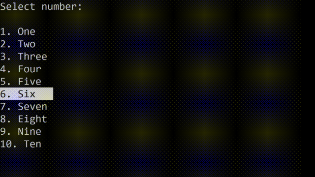

# ConsoleMenu
Consolemenu on python 3    
Powered by [pynput](https://pypi.org/project/pynput/) and [colorama](https://pypi.org/project/colorama/)
# Description 
Модуль позволяющий сделать меню выбора с помощью стрелок для управления. 
# Pip`s
```
pip install pynput colorama
```
# Code
```Python
import consolemenu # import module

array = ['One','Two','Three','Four','Five','Six','Seven','Eight','Nine','Ten'] # Array
sel = consolemenu.start(array, mode=1, title='Select number') # Function

print(f'You selected: {int(sel + 1)}') # This is not necessary
input()
```
# Mode
Mode=1 - Выделение цветом    
Mode=0[по умолчанию] - Выделение стрелочкой
# Title
По умолчанию title=None но если вам нужен заголовок просто поменяйте переменную как в демонстрации.
# In console
Mode 0    
    
Mode 1    

